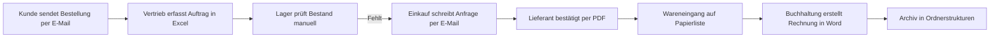

# Prozesse (IST) – Übersicht

```mermaid
flowchart LR
  A[Kunde sendet Bestellung per E-Mail] --> B[Vertrieb erfasst Auftrag in Excel]
  B --> C[Lager prüft Bestand manuell]
  C -->|Fehlt| D[Einkauf schreibt Anfrage per E-Mail]
  D --> E[Lieferant bestätigt per PDF]
  E --> F[Wareneingang auf Papierliste]
  F --> G[Buchhaltung erstellt Rechnung in Word]
  G --> H[Archiv in Ordnerstrukturen]
```
