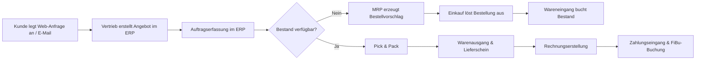

# Prozesse (SOLL) – Übersicht

```mermaid
flowchart LR
  A[Kunde legt Web-Anfrage an / E-Mail] --> B[Vertrieb erstellt Angebot im ERP]
  B --> C[Auftragserfassung im ERP]
  C --> D{Bestand verfügbar?}
  D -->|Ja| E[Pick & Pack]
  D -->|Nein| F[MRP erzeugt Bestellvorschlag]
  F --> G[Einkauf löst Bestellung aus]
  G --> H[Wareneingang bucht Bestand]
  E --> I[Warenausgang & Lieferschein]
  I --> J[Rechnungserstellung]
  J --> K[Zahlungseingang & FiBu-Buchung]
```
